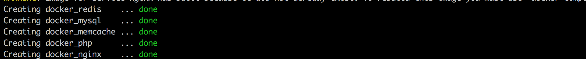
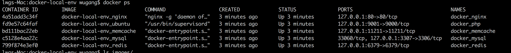

### 本地安装的软件
- `docker`
```
https://download.docker.com/mac/stable/Docker.dmg
```
> 打开运行即可  

- `mysql`(做本地映射连接使用)
```bash
$ brew install mysql
```
- `PHP`相关
```bash
$ brew install php71
$ curl -sS https://getcomposer.org/installer | php
$ mv composer.phar /usr/local/bin/composer
```
- `npm`相关（`npm`版本为8.11.1，可以使用`n`这个管理工具来配置）
```bash
$ brew install node
$ npm install n
$ n 8.11.1
```
### 获取代码
```bash
$ cd workspace
$ git clone git@gitlab.yiheinc.com:darkside/docker-local-env.git
```
### 一键部署构建
```bash
$ cd docker-local-env
$ docker-compose up -d
```
> 等待构建，没有报错，并且最后都显示绿色的`done`,即为成功  



> 运行`docker ps`,显示如下  

  

- 重新构建  

```bash
$ docker-compose up -d --build
```

<!-- ### `mysql`容器配置（可以外部访问连接）
```bash
$ docker exec -it <NAMES>/<CONTAINER ID> /bin/bash
$ mysql -uroot -proot
> grant all privileges on *.* to root@"%" identified by "password" with grant option; 
> flush privileges; 
> exit
$ exit
``` -->
### 本地配置

- 修改`~/.composer/auth.json`文件内容，替换写入  

```
{
  "http-basic": {
      "packagist.yiheinc.com": {
      "username": "devs",
      "password": "RKZfaVHHuHuHPRac7r"
      }
  }
}
```
- `数据库`等相关操作  

```bash
$ git submodule init
$ git  submodule update --remote
$ composer install
$ php artisan passport:client
$ php artisan key:generate
$ php artisan migrate
$ php artisan gctools:syncdata
```
<!-- - 创建`nginx`配置文件  

```bash
$ touch ~/workspace/nginx/conf.d/dev.conf 
```
> 将下面的信息写入该文件  

```
server {
    listen       80;
    server_name ~^(.+)\.(dev|dev\.1he\.me||stage\.focusyun\.com)$;
        set $file_path $1;
        if ($host = "wx.stage.focusyun.com"){
                set $file_path "h5focus";
        }
    root    /var/www/$file_path/public;
    location / {
        index index.html index.php;
        try_files $uri $uri/ /index.php?$query_string;
    }
    charset utf-8;
    error_page   500 502 503 504  /50x.html;
    location = /50x.html {
        root   html;
    }
    location ~ \.php$ {
        root    /var/www/$file_path/public;
        fastcgi_pass   docker-local-env_ubuntu_1:9000; # PHP-FPM default running on this port.
        fastcgi_index  index.php;
        include        fastcgi_params;
        fastcgi_param  SCRIPT_FILENAME $document_root$fastcgi_script_name;
    }
}
```
- 重启`nginx`镜像  

```bash
$ docker restart <NAMES>/<CONTAINER ID>
``` -->
### 注意
- 项目文件的`.env`文件需要更改`DB_HOST`的地址为`docker_mysql`，账号密码均为`root`  

> 电脑重启之后，需要再重新运行启动容器命令  

- 切换至docker项目目录  

```bash
$ docker-compose up -d
```
